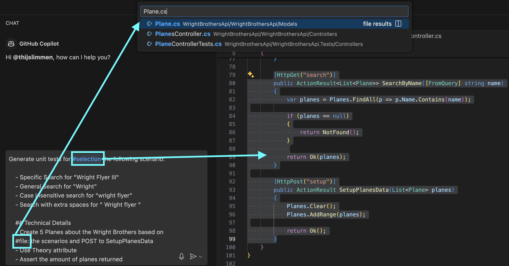
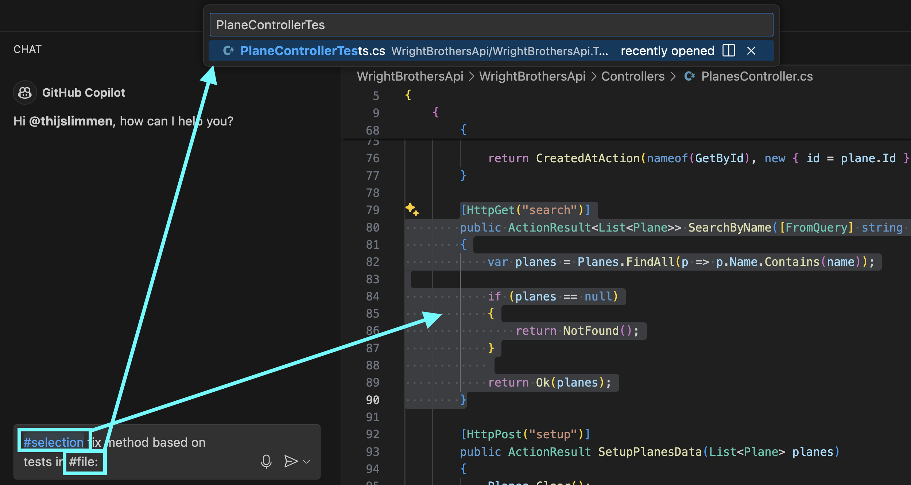
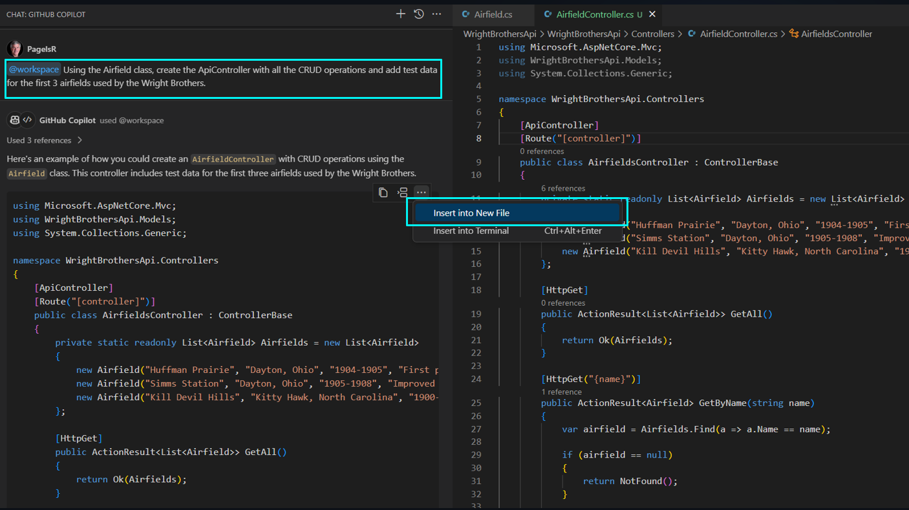
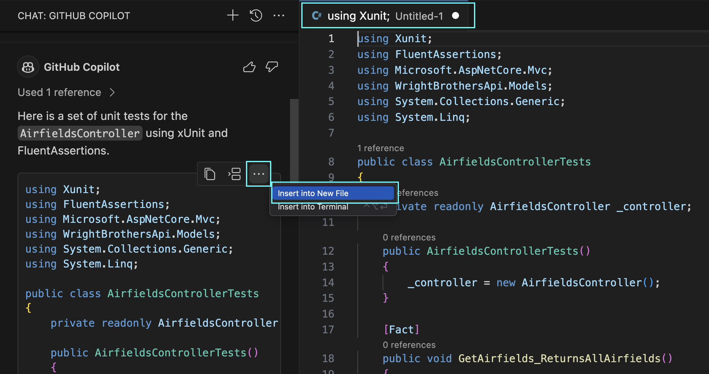

# Lab 2.2 - Taking Off with Code: Clearing the Runway

This lab exercise guides participants through coding exercises using GitHub Copilot to understand its suggestions and capabilities. It involves running and adding unit tests, with an emphasis on pair programming. The lab is structured in steps, starting with executing existing unit tests, followed by enhancing test coverage, and addressing specific functionalities like case sensitivity and trimming in search methods.

## Prerequisites
- The prerequisites steps must be completed, see [Labs Prerequisites](../Lab%201.1%20-%20Pre-Flight%20Checklist/README.md)

## Estimated time to complete

- 20 minutes, times may vary with optional labs.

## Objectives

- Simple coding exercises using GitHub Copilot, focusing on understanding its suggestions and capabilities.
- Pair programming: One 'pilot' codes, the other guides using Copilot's suggestions.

    - Step 1 - Taxying to the Runway - Run existing unit tests
    - Step 2 - Pre-takeoff Pilot Checks - Completing Unit Tests
    - Step 3 - Takeoff - Adding Unit Tests for Case Sensitivity (Optional)
    - Step 4 - Ascending to the Clouds: Creating the AirfieldController from thin air (Optional)

### Step 1: Taxying to the Runway - Run existing unit tests

- Open GitHub Copilot Chat, click **+** to clear prompt history.

- Type the following in the chat window:

    ```sh
    @workspace how do I run the unit tests?
    ```

- Copilot will give a suggestion to run the unit tests in the terminal.

    ```sh
    dotnet test
    ```

- Let's run the unit tests in the terminal to make sure everything is working as expected.

- From the Copilot Chat window, select one of the two options:

  1. Click the ellipses, `...`, select `Insert into Terminal`.

  1. If there isn't a terminal open, click the `Open in Terminal` button.

  1. Click copy button, then, open a new Terminal window by pressing **Ctrl+`** (Control and backtick), paste into Terminal window.

- Open the terminal and run the tests with the provided command.

    ```sh
    dotnet test
    ```

> [!NOTE]
> If you get an error resembling this: `MSBUILD : error MSB1009: Project file does not exist.`, then you are most likely running this command from the wrong folder. Change into the correct directory with `cd ./WrightBrothersApi` or with `cd ..` to go one folder level upwards.

- The tests should run and pass.

    ```sh
    Starting test execution, please wait...
    A total of 1 test files matched the specified pattern.
    Passed!  - Failed:  0, Passed:  3, Skipped:  0, Total:  3
    ```

### Step 2: Pre-takeoff Pilot Checks - Completing Unit Tests

- Open GitHub Copilot Chat, click **+** to clear prompt history.

- Type the following in the chat window:

    ```sh
    @workspace where do I add additional unit tests?
    ```

- Copilot will give a suggestion to add unit tests to the `Controllers/PlanesControllerTests.cs` file in the `WrightBrothersApi.Tests` project.

- You can add additional unit tests in the `PlanesControllerTests` class in the `WrightBrothersApi.Tests/Controllers/PlaneControllerTests.cs` file.


- Open Copilot Chat and Copy/Paste the following

    ```md
    Generate all unit test scenarios for #selection
    Use the existing list of planes for test data
    ```


- For `#selection`, open the `PlaneController.cs` file.

- Select all the code for the `GetById` method.

- Press `Enter`, GitHub Copilot will automatically suggest the `[Test]` attributes.

- The problem is that the generated test methods do not match with the style of the existing test methods in the `PlanesControllerTests.cs` file.

- Let's fix this. Open Copilot Chat and Copy/Paste the following and place your cursor after `tests should match `:

    ```md
    Generate all unit test scenarios for #selection and the tests should match the style in <---- Place your cursor here
    Use the existing list of planes for test data
    ```

- Delete `<---- Place your cursor here`, and type `#file` in the chat window and press Enter.


- A pop-up will appear where you can search for files.

> [!NOTE]
> With `#file` you can easily add a file to the Copilot Context.

- Select the file `PlanesControllerTests.cs` and press Enter.

> [!IMPORTANT]
> `#file` will not work with copy/pasting `#file:PlaneControllerTests.cs`. You need to select it from the pop-up window.

- Now submit the prompt by pressing Enter.

- Copilot will give a suggestion to generate all unit test scenarios for the `GetById` method.

    ```csharp
    [Fact]
    public void GetById_ExistingId_ReturnsPlane()
    {
        // Arrange
        var id = 1; // assuming a plane with this id exists

        // Act
        var result = _planesController.GetById(id);

        // Assert
        var okObjectResult = (OkObjectResult)result.Result!;
        var returnedPlane = (Plane)okObjectResult.Value!;
        returnedPlane.Should().NotBeNull();
        returnedPlane.Id.Should().Be(id);
    }

    [Fact]
    public void GetById_NonExistingId_ReturnsNotFound()
    {
        // Arrange
        var id = 999; // assuming no plane with this id exists

        // Act
        var result = _planesController.GetById(id);

        // Assert
        result.Result.Should().BeOfType<NotFoundResult>();
    }
    ```

> [!NOTE]
> Copilot generated two unit tests for the `GetById` method. The first test checks if the method returns a plane when the id exists. The second test checks if the method returns a `NotFound` result when the id does not exist. It also matches how the unit tests are structured in the `PlanesControllerTests.cs` file.

> [!NOTE]
> Creating unit tests works best when the scope is limited to a single method. You can then use `#file` to make sure it creates unit tests that is in line with the existing unit tests.

- Now Open `PlanesControllerTests.cs` and Place your cursor at the end of the file, after the `}` of the `GetAll_ReturnsListOfPlanes()` method.

```csharp
public class PlanesControllerTests
{
    [Fact]
    public void GetAll_ReturnsListOfPlanes()
    {
        // method body
    }

    <---- Place your cursor here
}
```

- In GitHub Copilot Chat, click the ellipses `...` and select `Insert at Cursor` for the suggested unit test methods.

- Let's test the newly added tests by opening the terminal and run the tests with the provided command.

    ```sh
    dotnet test
    ```

> [!NOTE]
> Some tests might still fail. Copilot does not always provide the correct suggestions. It's important to understand the suggestions and do some extra work to make sure the tests are correct. Copilot can help you with that as well.

- The tests should run and pass.

    ```sh
    Starting test execution, please wait...
    A total of 1 test files matched the specified pattern.
    Passed!  - Failed:  0, Passed:  5, Skipped:  0, Total:  5
    ```

## Optional

### Step 3: Taking Off - Developing Robust Tests

- Open the `PlanesController.cs` file.

- Make sure to add the `SearchByName` method to the `PlanesController.cs` file if you haven't already in the previous lab. If not, use the following code snippet to add the method at bottom of the file.

    ```csharp
    [HttpGet("search")]
    public ActionResult<List<Plane>> SearchByName([FromQuery] string name)
    {
        var planes = Planes.FindAll(p => p.Name.Contains(name));

        if (planes == null)
        {
            return NotFound();
        }

        return Ok(planes);
    }
    ```

- Also, add the following method at the bottom of file to setup data for the tests we are about to create.

    ```csharp
    [HttpPost("setup")]
    public ActionResult SetupPlanesData(List<Plane> planes)
    {
        Planes.Clear();
        Planes.AddRange(planes);

        return Ok();
    }
    ```

> [!NOTE]
> Setting up data like this is not recommended in a production environment. It's better to use a database or a mock database for this purpose. For the sake of this lab, we are using this approach.

- In the following exercise you will combine everything you learned in the previous steps, but then for the `SearchByName` method. The following prompt is a more detailed description of a problem and the expected solution. You will prompt GitHub Copilot to make it use a `#selection`. besides that you will use `#file` two times in the prompt to make sure Copilot knows the context of the problem.

- Open GitHub Copilot Chat, click **+** to clear prompt history.

- Copy/Paste the following in the Copilot Chat window:

    ```md
    Generate unit tests for #selection the following scenario:

    - Specific Search for "Wright Flyer III"
    - General Search for "Wright"
    - Case insensitive search for "wright flyer"
    - Search with extra spaces for " Wright flyer "

    ## Technical Details

    - Create 5 Planes about the Wright Brothers based on #file:Plane.cs for the scenarios and POST to SetupPlanesData
    - When Test Data contains 3 different "Wright Flyer" planes then assert count is also 3
    - Use Theory attribute
    - Assert the amount of planes returned
    - Use FluentAssertions

    Give me only the test method as a result to apply in #file:PlanesControllerTests.cs
    ```



- For `#selection`, select the following two methods in the `PlanesController.cs` class.

    ```csharp
    [HttpGet("search")]
    public ActionResult<List<Plane>> SearchByName([FromQuery] string name)
    {
        var planes = Planes.FindAll(p => p.Name.Contains(name));

        if (planes == null)
        {
            return NotFound();
        }

        return Ok(planes);
    }

    [HttpPost("setup")]
    public ActionResult SetupPlanesData(List<Plane> planes)
    {
        Planes.Clear();
        Planes.AddRange(planes);

        return Ok();
    }
    ```

- Next Re-enter `#file:Plane.cs`

> [!NOTE]
> When copy/posting the `#file:Plane.cs`, it will not work. You will need to select the file again from the pop-up window, like in the previous step.

- First remove `#file:Plane.cs` and keep your cursor at the same position.

- Next, type `#file` again in the chat window and press Enter, like in the previous step and select the `Plane.cs` file.

- Now, do the same for `#file:PlanesControllerTests.cs` on the bottom of the prompt.

> [!NOTE]
> This example shows how `#file` is used in a way how a human might approach a problem. You can include context at any time to help Copilot understand the problem or solution better.

- Open Copilot Chat and Copy/Paste the prompt.

- Submit the prompt by pressing Enter.

- Copilot will then give the following suggestion to generate unit tests for the `SearchByName` method.

    ```csharp
    [Theory]
    [InlineData("Wright Flyer III", 1)]
    [InlineData("Wright", 5)]
    [InlineData("wright flyer", 3)]
    [InlineData(" Wright flyer ", 3)]
    public void SearchByName_ReturnsExpectedPlanes(string searchTerm, int expectedCount)
    {
        // Arrange
        var planes = new List<Plane>
        {
            new Plane { Id = 1, Name = "Wright Flyer I", Year = 1903, Description = "First powered flight", RangeInKm = 37 },
            new Plane { Id = 2, Name = "Wright Flyer II", Year = 1904, Description = "Improved design", RangeInKm = 61 },
            new Plane { Id = 3, Name = "Wright Flyer III", Year = 1905, Description = "First practical plane", RangeInKm = 39 },
            new Plane { Id = 4, Name = "Wright Model A", Year = 1906, Description = "First production plane", RangeInKm = 100 },
            new Plane { Id = 5, Name = "Wright Model B", Year = 1910, Description = "Improved Model A", RangeInKm = 120 }
        };
        _planesController.SetupPlanesData(planes);

        // Act
        var result = _planesController.SearchByName(searchTerm);

        // Assert
        result.Result.Should().BeOfType<OkObjectResult>();
        var okObjectResult = (OkObjectResult)result.Result;
        var returnedPlanes = (List<Plane>)okObjectResult.Value;
        returnedPlanes.Count.Should().Be(expectedCount);
    }
    ```

- Open `PlanesControllerTests.cs` file

- Place your cursor at the end of the file, after the last unit test `}`.

    ```csharp
    public class PlanesControllerTests
    {
        /* Rest of the methods */

        <---- Place your cursor here
    }
    ```

- In GitHub Copilot Chat, click the ellipses `...` and select `Insert at Cursor` for the suggested unit test methods.

- Let's run the unit tests in the terminal:

    ```sh
    dotnet test
    ```

- Not all tests will pass. For example the `Case insensitive` and `Extra spaces` test will fail. This is because the `SearchByName` method is case sensitive. Let's fix this.

> ![Note] It could happen that Copilot already made the method case insensitve during creation. You can then continue with the next task as still some tests cases will fail.

    ```
    Starting test execution, please wait...
    A total of 1 test files matched the specified pattern.
    Failed!  - Failed:     2, Passed:     6, Skipped:     0, Total:     8
    ```

- Let's now use the generated tests as a guide to fix the case sensitivity issue.

- Open GitHub Copilot Chat, click **+** to clear prompt history.

- Copy/Paste the following in the chat window:

    ```
    #selection fix method based on tests in #file:PlaneControllerTests.cs
    ```

- Open `PlanesController.cs` file.

- For `#selection`, select the `SearchByName` method in the `PlanesController.cs` file.

    ```csharp
    [HttpGet("search")]
    public ActionResult<List<Plane>> SearchByName([FromQuery] string name)
    {
        var planes = Planes.FindAll(p => p.Name.Contains(name));

        if (planes == null)
        {
            return NotFound();
        }

        return Ok(planes);
    }
    ```

- First remove `#file:PlaneControllerTests.cs` and keep your cursor at the same position.

- Next, type `#file` again in the chat window and press Enter and select the `PlaneControllerTests.cs` file.



- Submit the prompt by pressing Enter.

- Copilot will give a suggestion to fix the case sensitivity and the extra spaces issue based on the test cases.

    ```csharp
    public class PlanesController : ControllerBase
    {
        /* Rest of the methods */

        [HttpGet("search")]
        public ActionResult<List<Plane>> SearchByName([FromQuery] string name)
        {
            var trimmedName = name.Trim();
            var planes = Planes.FindAll(p => p.Name.Trim().Equals(trimmedName, StringComparison.OrdinalIgnoreCase));

            if (planes == null || planes.Count == 0)
            {
                return NotFound();
            }

            return Ok(planes);
        }
    }
    ```

> [!NOTE]
> `StringComparer.OrdinalIgnoreCase` is used to make the comparison case insensitive and `Trim()` is used to remove leading and trailing spaces.

- Apply the changes to the `PlanesController.cs` file.

- Click on the `Insert at cursor` to replace the `SearchByName` method with the new one.

- Open the terminal and run the tests with the provided command

    ```sh
    dotnet test
    ```

- The tests should run and pass.

    ```sh
    Starting test execution, please wait...
    A total of 1 test files matched the specified pattern.
    Passed!  - Failed:     0, Passed:     5, , Failed:     0
    ```

> [!NOTE]
> If all tests pass, you have successfully completed this step. If not, you will need to debug the tests. GitHub Copilot got you started, but you, the Pilot, must take charge to diagnose and fix the discrepancies.

## Optional

### Step 4 - Ascending to the Clouds: Creating the AirfieldController from thin air

- Open the `WrightBrothersApi` project in Visual Studio Code.

- Open the `Models/Airfield.cs` file.

- Open GitHub Copilot Chat, click **+** to clear prompt history.

- Ask the following question:

    ```
    @workspace using the Airfield class, create the ApiController with all the CRUD operations and add test data for the first 3 airfields used by the Wright Brothers.
    ```

- Copilot will give a suggestion to create an `AirfieldController` class based on the `Airfield` class.

    ```csharp
    using Microsoft.AspNetCore.Mvc;
    using System.Collections.Generic;
    using WrightBrothersApi.Models;

    [ApiController]
    [Route("[controller]")]
    public class AirfieldsController : ControllerBase
    {
        private List<Airfield> Airfields = new List<Airfield>
        {
            new Airfield("Kitty Hawk", "North Carolina", "1900-1903", "First successful flight"),
            new Airfield("Huffman Prairie", "Ohio", "1904-1905", "First practical airplane"),
            new Airfield("Fort Myer", "Virginia", "1908-1909", "Military flight trials")
        };

        // GET: api/Airfields
        [HttpGet]
        public IEnumerable<Airfield> GetAirfields()
        {
            return Airfields;
        }

        // GET: api/Airfields/5
        [HttpGet("{id}")]
        public ActionResult<Airfield> GetAirfield(int id)
        {
            if (id < 0 || id >= Airfields.Count)
            {
                return NotFound();
            }

            return Airfields[id];
        }

        // POST: api/Airfields
        [HttpPost]
        public ActionResult<Airfield> PostAirfield(Airfield airfield)
        {
            Airfields.Add(airfield);
            return CreatedAtAction(nameof(GetAirfield), new { id = Airfields.Count - 1 }, airfield);
        }

        // PUT: api/Airfields/5
        [HttpPut("{id}")]
        public IActionResult PutAirfield(int id, Airfield airfield)
        {
            if (id < 0 || id >= Airfields.Count)
            {
                return NotFound();
            }

            Airfields[id] = airfield;
            return NoContent();
        }

        // DELETE: api/Airfields/5
        [HttpDelete("{id}")]
        public IActionResult DeleteAirfield(int id)
        {
            if (id < 0 || id >= Airfields.Count)
            {
                return NotFound();
            }

            Airfields.RemoveAt(id);
            return NoContent();
        }
    }
    ```

- In GitHub Copilot Chat, click the ellipses `...` and select `Insert into New File` for the suggested `AirfieldController`.

- Copilot will add the code to a new empty file, but must be saved.
- Save the file by clicking pressing `Ctrl + S` or `Cmd + S`.
- Change directory to the `Controllers` folder`.
- Enter the file name `AirfieldController.cs` and click `Save`.



> [!NOTE]
> Copilot is not only context aware, knows you need a list of items and knows the `Air Fields` used by the Wright Brothers, the `Huffman Prairie`, which is the first one used by the Wright Brothers.

- Now that you have created the `AirfieldController` with CRUD operations, it's time to ensure that it's working as expected. In this step, you will write unit tests for the `AirfieldController`.

- Open the `AirfieldController.cs` file.

- Open GitHub Copilot Chat, click **+** to clear prompt history.

- Ask the following question:

  ```
  @workspace create all the unit tests for this AirfieldController
  ```

- Copilot will give a suggestion to create an `AirfieldControllerTests` class based on the `AirfieldController` class with all the needed unit tests.

    ```csharp
    using Xunit;
    using FluentAssertions;
    using Microsoft.AspNetCore.Mvc;
    using WrightBrothersApi.Models;
    using System.Collections.Generic;
    using System.Linq;

    public class AirfieldsControllerTests
    {
        private readonly AirfieldsController _controller;

        public AirfieldsControllerTests()
        {
            _controller = new AirfieldsController();
        }

        [Fact]
        public void GetAirfields_ReturnsAllAirfields()
        {
            var result = _controller.GetAirfields();

            result.Should().NotBeNull();
            result.Count().Should().Be(3);
        }

        [Fact]
        public void GetAirfield_ValidId_ReturnsAirfield()
        {
            var result = _controller.GetAirfield(1);

            result.Result.Should().BeOfType<OkObjectResult>();
            ((OkObjectResult)result.Result).Value.Should().BeOfType<Airfield>();
        }

        [Fact]
        public void GetAirfield_InvalidId_ReturnsNotFound()
        {
            var result = _controller.GetAirfield(100);

            result.Result.Should().BeOfType<NotFoundResult>();
        }

        [Fact]
        public void PostAirfield_ValidAirfield_ReturnsCreatedAirfield()
        {
            var airfield = new Airfield("Test", "Test", "Test", "Test");
            var result = _controller.PostAirfield(airfield);

            result.Result.Should().BeOfType<CreatedAtActionResult>();
            ((CreatedAtActionResult)result.Result).Value.Should().BeEquivalentTo(airfield);
        }

        [Fact]
        public void PutAirfield_ValidIdAndAirfield_UpdatesAirfield()
        {
            var airfield = new Airfield("Updated", "Updated", "Updated", "Updated");
            var result = _controller.PutAirfield(1, airfield);

            result.Should().BeOfType<NoContentResult>();
            _controller.GetAirfield(1).Value.Should().BeEquivalentTo(airfield);
        }

        [Fact]
        public void PutAirfield_InvalidId_ReturnsNotFound()
        {
            var airfield = new Airfield("Updated", "Updated", "Updated", "Updated");
            var result = _controller.PutAirfield(100, airfield);

            result.Should().BeOfType<NotFoundResult>();
        }

        [Fact]
        public void DeleteAirfield_ValidId_RemovesAirfield()
        {
            var result = _controller.DeleteAirfield(1);

            result.Should().BeOfType<NoContentResult>();
            _controller.GetAirfield(1).Result.Should().BeOfType<NotFoundResult>();
        }

        [Fact]
        public void DeleteAirfield_InvalidId_ReturnsNotFound()
        {
            var result = _controller.DeleteAirfield(100);

            result.Should().BeOfType<NotFoundResult>();
        }
    }
    ```

- In GitHub Copilot Chat, click the ellipses `...` and select `Insert into New File` for the suggested `AirfieldControllerTests`.



- Copilot will add the code to a new empty file, but must be saved.
- Save the file by clicking pressing `Ctrl + S` or `Cmd + S`.
- Change directory to the `WrightBrothersApi.Tests/Controllers` folder`.
- Enter the file name `AirfieldControllerTests.cs` and click `Save`.

- Now let's run the unit tests in the terminal to make sure everything is working as expected.

- Open the terminal and run the tests with the provided command.

    ```sh
    dotnet test
    ```

- The tests should run and pass.

    ```sh
    Starting test execution, please wait...
    A total of 1 test files matched the specified pattern.
    Passed!  - Failed:  0, Passed:  8, Skipped:  0, Total:  8
    ```

> [!NOTE]
> Sometimes not all tests succeed. Make sure `dotnet test` is run in the root of the project `WrightBrothersApi`. If the tests fail, you will need to debug the tests and correct the issues. Although tools like Copilot can assist greatly, you, the Pilot, must take charge to diagnose and fix the discrepancies.

### Congratulations you've made it to the end! &#9992; &#9992; &#9992;

#### And with that, you've now concluded this module. We hope you enjoyed it! &#x1F60A;
