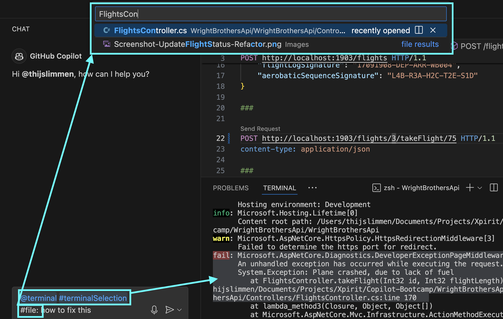
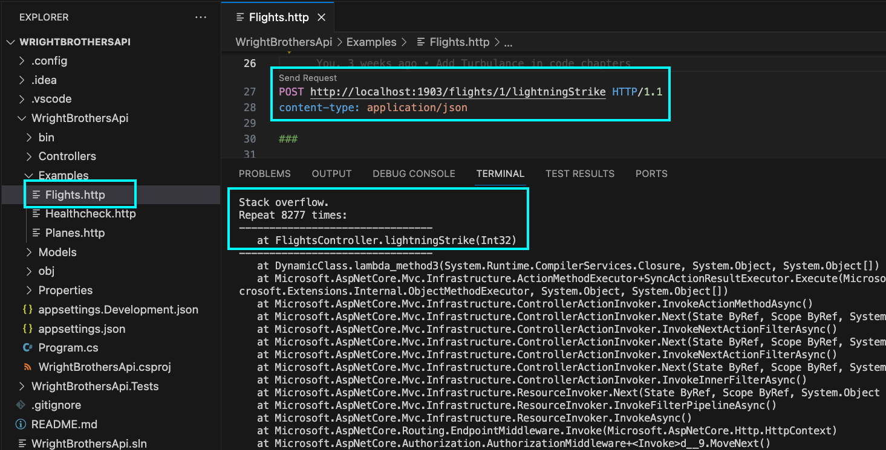
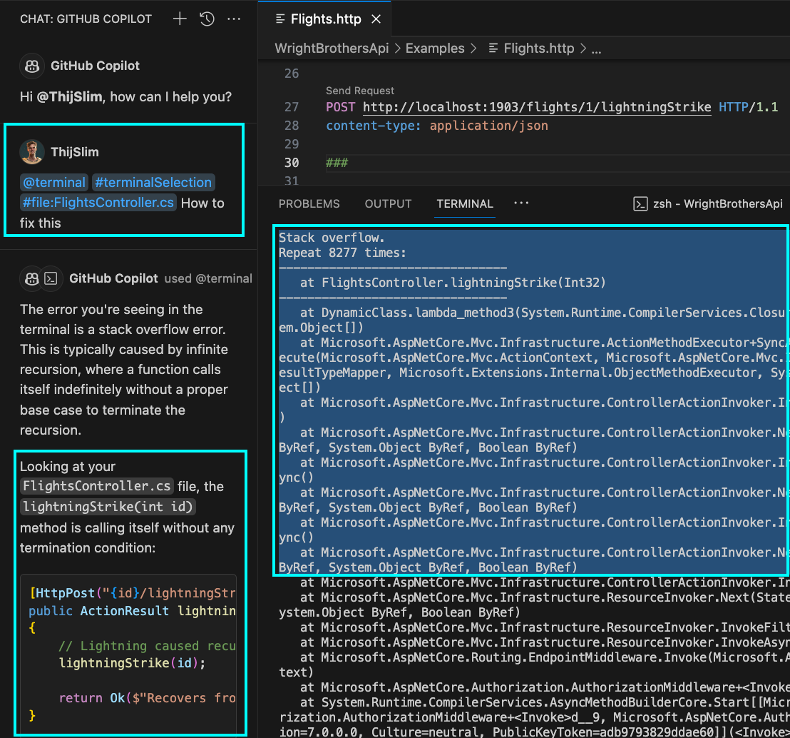
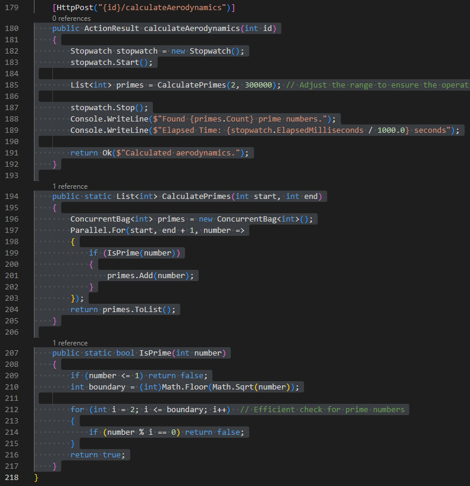

# Lab 3.1 - Aviation Incident Analysis: Troubleshooting with GitHub Copilot

The module simulates airplane crash scenarios using GitHub Copilot to identify and fix the root causes, enhancing understanding of Copilot's limitations and emphasizing human oversight in coding challenges.

A reference to the [Aviation Incident Analysis](<https://en.wikipedia.org/wiki/Mayday_(Canadian_TV_series)>) TV show, where the investigators try to find the root cause of an airplane crash. In this module, we will simulate a few airplane crashes and use GitHub Copilot to troubleshoot and fix the issues.

## Prerequisites
- The prerequisites steps must be completed, see [Labs Prerequisites](../Lab%201.1%20-%20Pre-Flight%20Checklist/README.md)

## Estimated time to complete

- 20 minutes, times may vary with optional labs.

## Objectives

- Understanding the limitations of GitHub Copilot and learning how to troubleshoot its suggestions.
- Group challenge to fix a set of buggy codes using Copilot, highlighting the importance of human oversight.
    - Step 1 - Flight Crash Investigation - Fuel Depletion Scenario
    - Step 2 - Lightning Strikes, Unexpected Flight Crash - Stack Overflow Scenario
    - Step 3 - Aerodynamics of an Airplane - Performance Optimization

### Step 1. Flight Crash Investigation - Fuel Depletion Scenario

- Open `FlightsController.cs` file located in the `Controllers` folder.

- Navigate to the `takeFlight` method.

> [!NOTE]
> The method simulates a flight and throws an exception if the flight runs out of fuel.

```csharp
public class FlightsController : ControllerBase
{
    [HttpPost("{id}/takeFlight/{flightLength}")]
    public ActionResult takeFlight(int id, int flightLength)
    {
        var flight = Flights.Find(f => f.Id == id);

        for (int i = 0; i < flightLength; i++)
        {
            if (flight.FuelRange == 0)
            {
                throw new Exception("Plane crashed, due to lack of fuel");
            }
            else
            {
                var fuelConsumption = 1;

                if (flight.FuelTankLeak)
                {
                    fuelConsumption = 2;
                }

                flight.FuelRange -= fuelConsumption;
            }
        }

        return Ok($"Flight took off and flew {flightLength} kilometers/miles.");
    }
}
```

- Open a terminal and navigate to the `WrightBrothersApi` folder

- Run the application

    ```sh
    dotnet run
    ```

> [!NOTE]
> If you encounter an error message like `Project file does not exist.` or `Couldn't find a project to run.`, it's likely that you're executing the command from an incorrect directory. To resolve this, navigate to the correct directory using the command `cd ./WrightBrothersApi`. If you need to move one level up in the directory structure, use the command `cd ..`. The correct directory is the one that contains the `WrightBrothersApi.csproj` file.

- Open the `Examples/Flights.http` file.
- Click `Send Request` to execute the `takeFlight` request.

```
Send Request
POST http://localhost:1903/flights/1/takeFlight/75 HTTP/1.1
content-type: application/json
```

> [!NOTE]
> You must have the `Rest Client` with identifier `humao.rest-client` extension installed in Visual Studio Code to execute the request. Rest Client is a very useful extension to quickly execute HTTP requests and commit them to Git.

> [!NOTE]
> The flight is taking off and the response is `200 OK`. The flight that is simulated did not run out of fuel.

```json
HTTP/1.1 200 OK
Connection: close
```

- Now execute the request again, but now for flight `3`.

- Change the `1` to `3` in the request and execute it again.

```
POST http://localhost:1903/flights/3/takeFlight/75 HTTP/1.1
content-type: application/json
```

- You will see that the flight is taking off and the response is `500 Internal Server Error`. The flight that is simulated ran out of fuel and crashed.

- The Rest Client response will now include the `FlightLog` property as follows:

    ```json
    HTTP/1.1 500 Internal Server Error
    Connection: close

    System.Exception: Plane crashed, due to lack of fuel
    at FlightsController.takeFlight(Int32 id, Int32 flightLength) in C:\Temp\WrightBrothersApi\WrightBrothersApi\Controllers\FlightsController.cs:line 174
    ```

- Stop the app by pressing `Ctrl + C` or `Cmd + C` in the terminal, or by clicking on the 'Stop' button in the debugger panel.

- Now, let's debug it with GitHub Copilot

- Navigate to the `Terminal` and `Select` all the content of the throw exception.

- Open GitHub Copilot Chat, click **+** to clear prompt history, then ask the following question:

- Run the following command in the GitHub Copilot Chat:

  ```
  @terminal #terminalSelection #file:FlightsController.cs how to fix this
  ```


  
> [!NOTE]
> `@workspace` does not work in combination with `@terminal`. So it does not have additional context to generate the suggestion. To add more context to the suggestion you can use `#file:FlightsController.cs`.

- Copilot will suggest a possible fix on how to handle the exception.

- You can go ahead and replace the `takeFlight` method with the new one and run the application again.

- Run the application

    ```sh
    dotnet run
    ```

- Now go to `Examples/Flights.http` file, click `Send Request` to execute the `takeFlight` request again.

## Optional

### Step 2. Lightning Strikes, Unexpected Flight Crash - Stack Overflow Scenario

- Open `FlightsController.cs` file located in the `Controllers` folder.

- Navigate to the `lightningStrike` method.

> [!NOTE]
> The method simulates a lightning strike and causes recursion.

```csharp
public class FlightsController : ControllerBase
{
    // Rest of the FlightsController.cs file

    [HttpPost("{id}/lightningStrike")]
    public ActionResult lightningStrike(int id)
    {
        // Lightning caused recursion on an inflight instrument
        lightningStrike(id);

        return Ok($"Recovers from lightning strike.");
    }
}
```

- Open a terminal and navigate to the `WrightBrothersApi` folder

- Run the application

    ```sh
    dotnet run
    ```

> [!NOTE]
> If you encounter an error message like `Project file does not exist.` or `Couldn't find a project to run.`, it's likely that you're executing the command from an incorrect directory. To resolve this, navigate to the correct directory using the command `cd ./WrightBrothersApi`. If you need to move one level up in the directory structure, use the command `cd ..`. The corrcect directory is the one that contains the `WrightBrothersApi.csproj` file.

- Go to the `Examples/Flights.http` file, click `Send Request` to execute the `lightningStrike` request.

    ```
    Send Request
    POST http://localhost:1903/flights/1/lightningStrike HTTP/1.1
    content-type: application/json
    ```

- The application will crash.

    ```json
    Stack overflow.
    at FlightsController.lightningStrike(Int32)
    ```



- Now, let's debug it with GitHub Copilot

- Navigate to the `Terminal` and `select` all the content of the thrown exception.

- Open GitHub Copilot Chat, click **+** to clear prompt, then ask the following question:

- Run the following command in the GitHub Copilot Chat:

    ```
    @terminal #terminalSelection #file:FlightsController.cs how to fix this
    ```



- Copilot will suggest how to handle recursion by adding a condition to stop the recursion:

```csharp
public class FlightsController : ControllerBase
{
    // Rest of the FlightsController.cs file

    [HttpPost("{id}/lightningStrike")]
    public ActionResult lightningStrike(int id, int recursionDepth = 10)
    {
        if (recursionDepth == 0)
        {
            return Ok($"Recovers from lightning strike.");
        }

        // Lightning caused recursion on an inflight instrument
        lightningStrike(id, recursionDepth - 1);

        return Ok($"Recovers from lightning strike.");
    }
```

> [!NOTE]
> This is an extreme example. In the real world you will probably not see this often. This example does show how GitHub Copilot can help with debugging and troubleshooting and this technique is applicable to other scenarios as well.

- You can go ahead and replace the `lightningStrike` method with the new one and run the application again.

- Run the application

    ```sh
    dotnet run
    ```

- Now go to `Examples/Flights.http` file, click `Send Request` to execute the `lightningStrike` request again.

    ```
    Send Request
    POST http://localhost:1903/flights/1/lightningStrike HTTP/1.1
    content-type: application/json
    ```

- The application will now recover from the lightning strike.

## Optional

### Step 3. Aerodynamics of an Airplane - Performance Optimization

- Open `FlightsController.cs` file located in the `Controllers` folder.

- Navigate to the `calculateAerodynamics` method.

> [!NOTE]
> The method is calculating prime numbers.

```csharp
public class FlightsController : ControllerBase
{
    [HttpPost("{id}/calculateAerodynamics")]
    public ActionResult calculateAerodynamics(int id)
    {
        Stopwatch stopwatch = new Stopwatch();
        stopwatch.Start();

        List<int> primes = CalculatePrimes(2, 300000);

        stopwatch.Stop();
        Console.WriteLine($"Found {primes.Count} prime numbers.");
        Console.WriteLine($"Elapsed Time: {stopwatch.ElapsedMilliseconds / 1000.0} seconds");

        return Ok($"Calculated aerodynamics.");
    }

    public static List<int> CalculatePrimes(int start, int end)
    {
        List<int> primes = new List<int>();
        for (int number = start; number <= end; number++)
        {
            if (IsPrime(number))
            {
                primes.Add(number);
            }
        }
        return primes;
    }

    public static bool IsPrime(int number)
    {
        if (number <= 1) return false;
        for (int i = 2; i < number; i++)
        {
            if (number % i == 0) return false;
        }
        return true;
    }
}
```

- Open a terminal and navigate to the `WrightBrothersApi` folder

- Run the application

    ```sh
    dotnet run
    ```

> [!NOTE]
> If you encounter an error message like `Project file does not exist.` or `Couldn't find a project to run.`, it's likely that you're executing the command from an incorrect directory. To resolve this, navigate to the correct directory using the command `cd ./WrightBrothersApi`. If you need to move one level up in the directory structure, use the command `cd ..`. The corrcect directory is the one that contains the `WrightBrothersApi.csproj` file.

- Now go to `Examples/Flights.http` file, click `Send Request` to execute the `calculateAerodynamics` request.

    ```
    Send Request
    POST http://localhost:1903/flights/1/calculateAerodynamics HTTP/1.1
    content-type: application/json
    ```

- Response will be:

    ```json
    HTTP/1.1 200 OK
    Connection: close
    ```

- Terminal will show something like this:

    ```json
    Found 25997 prime numbers.
    Elapsed Time: 4.863 seconds
    ```

- The application will calculate the prime numbers in more than 5 seconds.

- Stop the app by pressing `Ctrl + C` or `Cmd + C` in the terminal, or by clicking on the 'Stop' button in the debugger panel.

- Now, let's use GitHub Copilot to optimize the code.

- Open the Copilot Chat .

- Open `FlightsController.cs` and select all the code for the 3 following methods:

    - `calculateAerodynamics` method.
    - `CalculatePrimes` method.
    - `IsPrime` method.

    

- Ask the following question in GitHub Copilot Chat:

    ```
    Can you optimize the selected code?
    ```

- Copilot will optimize the code.

- Click on the `Insert at cursor` to replace the `calculateAerodynamics` method with the new one.

- Run the application

    ```sh
    dotnet run
    ```

- Now go to `Examples/Flights.http` file, click `Send Request` to execute the `calculateAerodynamics` request again.

    ```
    Send Request
    POST http://localhost:1903/flights/1/calculateAerodynamics HTTP/1.1
    content-type: application/json
    ```

    Example output

    ```
    Found 25997 prime numbers.
    Elapsed Time: 0.014 seconds
    ```

- The application will now calculate the prime numbers in less than 50 milliseconds.

> [!NOTE]
> GitHub Copilot has knowledge of many algorithmic optimizations and can help you optimize your code performance.

### Congratulations you've made it to the end! &#9992; &#9992; &#9992;

#### And with that, you've now concluded this module. We hope you enjoyed it! &#x1F60A;
