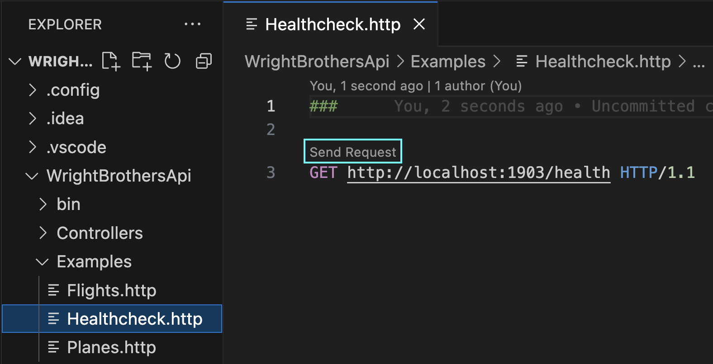

# Lab 3.2 - Auto-Pilot Mode: AI Assistance in Software Development

This lab exercise demonstrates integrating GitHub Copilot into .NET application development to implement health checks, automate CI/CD pipelines for Azure deployment, and explore AI's role in enhancing software development efficiency through practical programming tasks.

## Prerequisites
- The prerequisites steps must be completed, see [Labs Prerequisites](../Lab%201.1%20-%20Pre-Flight%20Checklist/README.md)

## Estimated time to complete

- 20 min, times may vary with optional labs.

## Objectives

- Demonstrate GitHub Copilot's capabilities in .NET development, focusing on automating health checks, CI/CD pipelines for Azure, infrastructure as code, and generating concise "Summarized Check in Comments" and "Summarized Pull Request Comments".
- Highlight Copilot's impact on streamlining development workflows, improving code quality, and enhancing collaboration through practical tasks.
    - Step 1 - Fasten your seatbelts, turbulence incoming - Committing Code Changes
    - Step 2 - Smooth Flying in the Cloud - Automating GitHub Pipelines
    - Step 3 - Ground Control - How to assent to the Azure Cloud
    - Step 4 - Flight Plan - Crafting a Detailed DevOps Pipeline with Bicep IaC (Optional)
    - Step 5 - Turn on Autopilot Mode - Automating GitHub Pull Requests (Optional)

### Step 1. Fasten your seatbelts, turbulence incoming - Committing Code Changes

- Open `Program.cs` in `WrightBrothersApi` folder

- Note the following code that adds a health check to the application. The healthcheck simulates a health check that sometimes is healthy, sometimes is degraded, and sometimes is unhealthy.

    ```csharp
    // Other code

    var builder = WebApplication.CreateBuilder(args);

    builder.Services.AddHealthChecks()
    .AddCheck("CruisingAltitudeCheck", () =>
    {
        bool atCruisingAltitude = CheckSystemPerformance();

        if (atCruisingAltitude)

        {
            return HealthCheckResult.Healthy("The application is cruising smoothly at optimal altitude.");
        }
        else
        {
            bool minorIssue = CheckIfMinorIssue();

            return minorIssue ?
                HealthCheckResult.Degraded("The application is experiencing turbulence but remains stable.") :
                HealthCheckResult.Unhealthy("The application is facing a system failure and needs immediate attention.");
        }

        bool CheckSystemPerformance()
        {
            // Simulate a check to determine if the application is "at cruising altitude"
            // For the sake of this example, we'll just return a random value
            Random random = new Random();
            int randomNumber = random.Next(1, 100);

            return randomNumber > 10;
        }

        bool CheckIfMinorIssue()
        {
            // Simulate a check to determine if the application is "at cruising altitude"
            // For the sake of this example, we'll just return a random value
            Random random = new Random();
            int randomNumber = random.Next(1, 100);

            return randomNumber > 50;
        }
    });

    // Other code
    ```

- Run the application to see the health check in action.

    ```sh
    cd WrightBrothersApi
    dotnet run
    ```

> [!NOTE]
> If you encounter an error message like `Project file does not exist.` or `Couldn't find a project to run.`, it's likely that you're executing the command from an incorrect directory. To resolve this, navigate to the correct directory using the command `cd ./WrightBrothersApi`. If you need to move one level up in the directory structure, use the command `cd ..`. The corrcect directory is the one that contains the `WrightBrothersApi.csproj` file.

- Open the `Examples/Healthcheck.http` file, click `Send Request` to execute the `health` request.



- Click the `Send Request` button for the `GET` below:

    ```json
    GET http://localhost:1903/health HTTP/1.1
    ```

- The response should be `200 OK` with the following body:

    ```json
    {
        "status": "Healthy", // or "Degraded" or "Unhealthy"
        "totalDuration": "00:00:00.0000001"
    }
    ```

- Stop the application by pressing `Ctrl+C` in the terminal.

- Let's make a small change to the code. Change the `CheckSystemPerformance` method to return a random number greater than 50. This will simulate a more unstable system.

    ```csharp
    bool CheckSystemPerformance()
    {
        // Simulate a check to determine if the application is "at cruising altitude"
        // For the sake of this example, we'll just return a random value
        Random random = new Random();
        int randomNumber = random.Next(1, 100);

        return randomNumber > 50;
    }
    ```

- Create a new feature branch `feature/health-checks` from the `main` branch in your terminal

```sh
git checkout -b feature/health-checks
```

- Open the Source Control tab in VS Code

- In the `Changes` area, click the `+` icon to `Stage all changes`

- Click on the `Magic` icon to generate a commit message


> [!NOTE]
> GitHub Copilot Chat suggests a commit message based on the changes made to the code. This is a great way to get started with a commit message.

- Click the `✓ Commit & Sync` button to commit the changes.


- Click the `Publish branch` button to push the changes.


### Step 2. Smooth Flying in the Cloud - Automating GitHub Pipelines

A build pipeline automates your software's build, test, and deployment processes, ensuring consistent and error-free releases while saving time and improving code quality. It streamlines development, enables quick feedback, and supports efficient version management. Let's begin by
automating CI/CD pipelines for deployment to Azure.

- Open GitHub Copilot Chat

- Type the following command

    ```
    @workspace create a build pipeline
    ```

- GitHub Copilot Chat will suggest creating a GitHub Actions build pipeline for the application. It also includes a build step and a test step.

    ```yaml
    name: .NET Core CI

    on:
    push:
        branches: [main]
    pull_request:
        branches: [main]

    jobs:
      build:
        runs-on: ubuntu-latest

        steps:
        - uses: actions/checkout@v2

        - name: Setup .NET
          uses: actions/setup-dotnet@v1
          with:
            dotnet-version: 7.0.x

        - name: Restore dependencies
          run: dotnet restore "WrightBrothersApi/WrightBrothersApi.csproj"

        - name: Build
          run: dotnet build "WrightBrothersApi/WrightBrothersApi.csproj" --configuration Release --no-restore

        - name: Test
          run: dotnet test "WrightBrothersApi.Tests/WrightBrothersApi.Tests.csproj" --no-restore --verbosity normal
    ```

- In GitHub Copilot Chat, click the ellipses `...` and select `Insert into New File` for the suggested pipeline.

- Copilot will add the code to a new empty file, but must be saved.

- Save the file by clicking pressing `Ctrl + S` or `Cmd + S`.

- Change directory to the `.github/workflows` folder`.

- Enter the file name `Build.yml` and click `Save`.

> [!NOTE]
> With the @workspace agent, GitHub Copilot understands that the current workspace is a .NET application with a Test project in it. It also understands that the application is hosted in a folder called `WrightBrothersApi` and the test project is in a folder called `WrightBrothersApi.Tests`. This is a great example of how GitHub Copilot can understand the context of the current workspace and provide suggestions based on that context.

### Step 3. Ground Control - How to assent to the Azure Cloud

Deploying your application to Azure facilitates scalable, secure, and efficient hosting, leveraging Microsoft's cloud infrastructure. This allows for easy scaling, robust disaster recovery, and global reach, enhancing your app's performance and accessibility while minimizing maintenance efforts and costs.

> [!WARNING]  
> You must complete the previous lab before continuing.

- Pre-requisite is a valid `*.yml` build pipeline from previous step.

- Select all the content of the `Build.yml`.

- In GitHub Copilot Chat, click **+** to clear prompt history, then type the following command.

    ```
    Deploy to Azure
    ```


- GitHub Copilot Chat will suggest adding a deploy step to the pipeline, which is a Azure Web App deployment.

    ```yaml
    # Rest of the pipeline

    deploy:
        needs: build
        runs-on: ubuntu-latest
        steps:
        - name: Login to Azure
            uses: azure/login@v1
            with:
            creds: ${{ secrets.AZURE_CREDENTIALS }}

        - name: Deploy to Azure Web App
            uses: azure/webapps-deploy@v2
            with:
            app-name: 'your-app-name' # replace with your app name
            publish-profile: ${{ secrets.AZURE_PUBLISH_PROFILE }}
            package: './WrightBrothersApi'
    ```

- Open the `Build.yml` file in the `.github/workflows` folder.

- Place your cursor at the end of the file.

```yaml
# Rest of the pipeline

<-- Place your cursor here
```

- In GitHub Copilot Chat, click the ellipses `...` and select `Insert at Cursor` for the suggested unit test methods.

- Save the file by clicking pressing `Ctrl + S` or `Cmd + S`.

- Now the pipeline first builds the application, then deploys it to Azure.

- Next, we are going to create the infrastructure as code files using Bicep that we need for a Web App in Azure.

- Start a new chat with GitHub Copilot Chat and type the following command.

    ```
    @workspace create the infrastructure as Code files using Bicep that I need for a Web App in Azure. Only give me the Bicep files
    ```

- In GitHub Copilot Chat, click the ellipses `...` and select `Insert into New File` for the suggested pipeline.

- Copilot will add the code to a new empty file, but must be saved.

- Save the file by clicking pressing `Ctrl + S` or `Cmd + S`.

- Create a new folder called `Infrastructure` in the root of the project.

- Enter the file name `Main.bicep` and click `Save` in the `Infrastructure` folder.

> [!IMPORTANT]
> GitHub Copilot Chat will suggest creating a Bicep files for the infrastructure. If Copilot suggested multiple files, save all of them accordingly.

- Now let's add a step to the pipeline to deploy the infrastructure as code.

- Open GitHub Copilot Chat, , click **+** to clear prompt history.

- Make sure to have the `.github/workflows/Build.yaml` file open in VS Code.

- Open Copilot Chat and type the following command.

    ```
    Add a step to the pipeline to deploy the infrastructure as code #file:Main.bicep
    ```

- GitHub Copilot will suggest steps to deploy the infrastructure as code using the Bicep file.

```yaml
# Rest of the pipeline

- name: Login to Azure
  uses: azure/login@v1
  with:
    creds: ${{ secrets.AZURE_CREDENTIALS }}

- name: Deploy Infrastructure
  uses: azure/cli@v1
  with:
    inlineScript: |
      az deployment group create --resource-group myResourceGroup --template-file ./main.bicep
```

- In this lab we have created a build pipeline that builds the application, runs the tests, and deploys the application to Azure. We have also created the infrastructure as code files using Bicep and added a step to the pipeline to deploy the infrastructure as code.

> [!NOTE]
> The results of Copilot might not be perfect, but it can be a great starting point for you to build upon. You are the pilot, you need to make sure the pipeline is correct.

## Optional

### Step 4. Flight Plan - Crafting a Detailed DevOps Pipeline with Bicep IaC

Using Infrastructure as Code (IaC) to manage your cloud resources, specifically with Bicep for Azure environments, offers several significant advantages that make it an essential practice for modern cloud infrastructure management.

> [!NOTE]
> GitHub Copilot's advanced prompt is a powerful feature that allows you to ask complex questions and receive detailed responses. It can help you plan and execute complex tasks, ensuring that all steps are clearly defined and logically sequenced for efficient execution.

#### Scenario 1 - Describe a Single DevOps Pipeline with Three Stages

This prompt will create a decription for creating a DevOps pipeline with three stages: Build, Infrastructure as Code (IaC), and Quality Assurance (QA). It outlines the requirements for each stage, including describing the application, specifying the Azure resources needed, creating Bicep templates, and detailing the steps for deploying the application to Azure for QA purposes.

- Open GitHub Copilot Chat, , click **+** to clear prompt history.

- Ask the following advanced `Chain of Thought` prompt engineered question:

    ```
    Create a single DevOps pipeline comprising three stages: Build, Infrastructure as Code (IaC), and Quality Assurance (QA).

    - **Task 1: Build Stage**
    - Describe the application and its architecture.
    - List the programming languages and frameworks used.
    - Outline the steps needed to compile and build the application.

    - **Task 2: IaC (Infrastructure as Code) Stage**
    - Explain what Bicep is and why it's chosen for this project.
    - Specify the Azure resources required for the application (e.g., App Service, Azure SQL Database).
    - Request the creation of Bicep templates for these resources, highlighting any dependencies between them.

    - **Task 3: QA (Quality Assurance) Stage**
    - Describe the deployment environment in Azure.
    - List the tests that need to be performed (e.g., unit tests, integration tests, UI tests).
    - Detail the steps for deploying the application to Azure for QA purposes.

    Please create a comprehensive plan for each stage, ensuring that all steps are clearly defined and logically sequenced for efficient execution.

    Let's think step by step.
    ```

> [!NOTE]
> This prompt adds clarity by breaking down each stage into more detailed tasks and requesting specific outcomes. This method encourages Copilot to follow a logical sequence of thoughts and generate outputs that closely align with your requirements. By providing more context and detail, you increase the likelihood of receiving a comprehensive and actionable plan from GitHub Copilot.

#### Scenario 2 - Refining the DevOps Pipeline with Detailed File Outlines

To refine the Chain of Thought prompt further, incorporating explicit instructions for GitHub Copilot to scaffold out each required file, let's adjust the prompt to specify the creation of file outlines or templates.

This prompt will create a plan to set up a CI/CD pipeline for a .NET 7 Web API application. It includes a build stage for compiling the solution and running tests, an Infrastructure as Code (IaC) stage using Bicep for Azure resource deployment, and a Quality Assurance (QA) stage for deploying the application to a QA environment and running tests. The workflows are chained together using the workflow_run event.

This approach will help in generating a more structured and practical output that includes the scaffolding for each stage of the project.

- Open GitHub Copilot Chat, click **+** to clear prompt history.

- Ask the following advanced `Chain of Thought` prompt engineered question:

    ```
    Let's set up a CI/CD pipeline for a .NET 7 Web API application, which includes stages for Build, Infrastructure as Code (IaC) deployment using Bicep, and Quality Assurance (QA). Each stage should be clearly defined, and necessary files and configurations must be scaffolded out.

    1. **Build Stage for .NET 7 Web API**:
    - The application is built with .NET 7, utilizing C# as the programming language. Scaffold the build process, which should include steps for restoring NuGet packages, compiling the solution, running unit tests, and publishing the output. Create a 'build.yml' file that outlines these steps for the CI pipeline.

    2. **IaC Stage with Bicep Execution**:
    - For deployment to Azure, identify the required Azure resources (e.g. Azure App Service for hosting the Web API). Scaffold Bicep templates for these resources, ensuring they're modular and reusable.
    - Create a 'main.bicep' file that acts as the entry point, invoking other Bicep files (e.g. 'appservice.bicep') to define the entire infrastructure. Include a step in the CI/CD pipeline ('iac-deploy.yaml') to authenticate with Azure and execute 'main.bicep', deploying the infrastructure.

    3. **QA Stage**:
    - Detail the process for deploying the .NET 7 Web API to the provisioned Azure App Service in a QA environment. This includes running integration and acceptance tests.
    - Scaffold a 'qa-deploy.yml' file that outlines the steps for deploying the application to Azure, setting up the environment, and executing tests.

    4. **Chain Workflows**:
    - Use the workflow_run event to ensure that the Build workflow triggers the IaC workflow, which then triggers the QA workflow.
    - This event will aloow to trigger a workflow as a result of another workflow's completion.

    In addition to scaffolding these files, provide explanations for each file's purpose and the critical sections within them. This approach ensures a comprehensive understanding and correct implementation of the pipeline for deploying a .NET 7 Web API application to Azure."
    ```

> [!NOTE]
> This prompt is structured to ensure that GitHub Copilot generates a detailed plan, breaking down the requirements for a .NET 7 Web API application's CI/CD pipeline, including specific focus on IaC with Bicep for Azure deployments. By explicitly asking for a 'main.bicep' to orchestrate the deployment of other Bicep modules, it directs the AI towards creating a scalable and maintainable infrastructure setup.

<details>
  <summary>Click to expand Solution</summary>

    #### Build Stage for .NET 7 Web API:
    ```
    # build.yaml
    trigger:
    - main

    pool:
    vmImage: 'windows-latest'

    variables:
    buildConfiguration: 'Release'

    steps:
    - task: NuGetToolInstaller@1

    - task: NuGetCommand@2
    inputs:
        restoreSolution: '**/*.sln'

    - task: VSBuild@1
    inputs:
        solution: '**/*.sln'
        msbuildArgs: '/p:DeployOnBuild=true /p:WebPublishMethod=Package /p:PackageAsSingleFile=true /p:SkipInvalidConfigurations=true /p:DesktopBuildPackageLocation="$(build.artifactStagingDirectory)\WebApp.zip" /p:DeployIisAppPath="Default Web Site"'
        platform: '$(BuildPlatform)'
        configuration: '$(BuildConfiguration)'

    - task: VSTest@2
    inputs:
        platform: '$(BuildPlatform)'
        configuration: '$(BuildConfiguration)'

    - task: PublishBuildArtifacts@1
    ```

    #### IaC Stage with Bicep Execution
    ```
    // main.bicep
    targetScope = 'resourceGroup'

    module appService './appservice.bicep' = {
    name: 'appServiceModule'
    params: {
        name: 'myAppService'
    }
    }

    # iac-deploy.yaml
    trigger:
    - main

    pool:
    vmImage: 'windows-latest'

    steps:
    - task: AzureCLI@2
    inputs:
        azureSubscription: '<Azure-Subscription-Name>'
        scriptType: 'bash'
        scriptLocation: 'inlineScript'
        inlineScript: 'az deployment group create --resource-group <Resource-Group-Name> --template-file ./main.bicep'
    ```

    #### QA Stage
    ```
    # qa-deploy.yaml
    trigger:
    - main

    pool:
    vmImage: 'windows-latest'

    steps:
    - task: AzureRmWebAppDeployment@4
    inputs:
        ConnectionType: 'AzureRM'
        azureSubscription: '<Azure-Subscription-Name>'
        appType: 'webApp'
        WebAppName: '<Web-App-Name>'
        packageForLinux: '$(Build.ArtifactStagingDirectory)/**/*.zip'

    - task: AzureCLI@2
    inputs:
        azureSubscription: '<Azure-Subscription-Name>'
        scriptType: 'bash'
        scriptLocation: 'inlineScript'
        inlineScript: 'az webapp config appsettings set --name <Web-App-Name> --resource-group <Resource-Group-Name> --settings "ASPNETCORE_ENVIRONMENT=QA"'

    - task: VSTest@2
    inputs:
        testAssemblyVer2: '**\*test*.dll'
        platform: '$(BuildPlatform)'
        configuration: '$(BuildConfiguration)
    ```
    
</details>
<br>

The evolution of the Chain of Thought (CoT) techniques across our conversation began with crafting a directive to create a single pipeline with stages for Build, IaC using Bicep, and QA for cloud resources. The initial CoT prompt lacked explicit steps and reasoning for each stage, focusing more on what to do rather than how and why to do it.

We then refined the approach to break down the task into more detailed steps, adding explanations and context to guide GitHub Copilot more effectively. This included describing the application, specifying resources, and detailing actions for each stage but still didn't fully integrate the execution of Bicep files.

Finally, we further adjusted the prompt for a .NET 7 Web API application, explicitly including the execution of Bicep files through a main.bicep file. This approach provided a detailed, step-by-step guide that not only outlined what needed to be done but also how to do it, specifically tailoring the tasks for .NET 7 and ensuring a modular and executable IaC setup.

> [!NOTE]
> By following this iterative process of refining the CoT prompt, you can effectively guide GitHub Copilot to generate more accurate and actionable outputs that align with your project requirements. This method helps in leveraging the AI's capabilities to scaffold out the necessary files and configurations, streamlining the development and deployment process for your cloud-based applications.

## Optional

## GitHub Copilot Enterprise Only

### Step 5. Turn on Autopilot Mode - Automating GitHub Pull Requests

> [!WARNING]  
> You must complete the previous lab before continuing.

> [!NOTE]
> Pull Request summaries in the GitHub.com portal is not yet supported for everyone. The trainer will demo this.

- Go to your `GitHub.com` repository.

- Click on the `Pull requests` tab.

- Click on the `New pull request` button

- Select the `main` branch for the base branch.
- Select the `feature/health-checks` branch as the compare branch


- Click the `Create pull request` button

- Click on the `Copilot` icon, select `Summary` to generate a summary of changes in this pull request.


- Click `Preview` to see the summary.


- Click `Create pull request` to create the pull request.

> [!IMPORTANT]  
> This is a `Copilot Enterprise` feature only! In order to use the Pull Request Summaries feature you need a Copilot Enterprise License and have this feature enabled in your GitHub account.

### Congratulations you've made it to the end! &#9992; &#9992; &#9992;

#### And with that, you've now concluded this module. We hope you enjoyed it! &#x1F60A;
